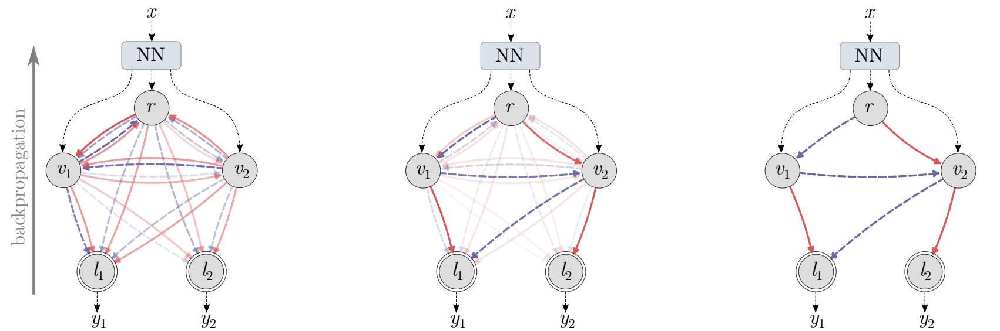

# SONGs: Self-Organizing Neural Graphs



The official implementation of the SONG model
described in [the paper](https://arxiv.org/abs/2107.13214).

## Dependencies

The implementation is done in Python 3.8. The packages used
to run the code:
- numpy
- pandas
- torch (>= 1.8)
- torchvision
- tabulate
- tqdm
- matplotlib
- seaborn

## Usage

### Training

Use the following commands to train the models:
  - for shallow models:
    - MNIST
        ```bash
        bash ./scripts/run_shallow.sh mnist use_tqdm 1 "" "" "--dirty_tau --prob_leaves_rate 1" ""
        ```
    - LETTER
        ```bash
        bash ./scripts/run_shallow.sh letter use_tqdm 1 "" "" "--dirty_tau --prob_leaves_rate 1" ""
        ```
    - CONNECT4
        ```bash
        bash ./scripts/run_shallow.sh connect4 use_tqdm 1 "" "" "--dirty_tau --prob_leaves_rate 1" ""
        ```
  - for deep model:
    - MNIST
        ```bash
        bash ./scripts/run_shallow.sh mnist use_tqdm 1 "representation" "./pretrained_models" "--dirty_tau --prob_leaves_rate 1" ""
        ```
    - CIFAR10
        ```bash
        bash ./scripts/run_deep.sh c10 use_tqdm 1 "resnet" "./pretrained_models" "--dirty_tau --prob_leaves_rate 1" ""
        ```
    - CIFAR100
      ```bash
      bash ./scripts/run_deep.sh c100 use_tqdm 1 "resnet" "./pretrained_models" "--dirty_tau --use_mixup_data --use_balanced_train_data --tau_regularization 1.05 --scale_nodes_loss 1e-4 --prob_leaves_rate 1" ""
      ```
    - TinyImagenet200
        ```bash
        bash ./scripts/run_deep.sh TinyImagenet200 use_tqdm 1 "resnet" "./pretrained_models" "--dirty_tau --use_mixup_data --use_balanced_train_data --tau_regularization 1.05 --scale_nodes_loss 1e-4 --prob_leaves_rate 1" ""
        ```

The folder `./pretrained_models` should contain the following files:
  - `mnist_cnn.pt`
  - `ckpt-CIFAR10-ResNet18.pth`
  - `ckpt-CIFAR100-ResNet18.pth`
  - `ckpt-TinyImagenet200-ResNet18.pth`


---

### Evaluation

Models can be evaluated using the following commands:
- shallow models:
    - MNIST
        ```bash
        path2model=?
        export PYTHONPATH=.
        python ./run/main_shallow.py --root_data ./dataset --data_type mnist --resume --path_resume ${path2model} --layers_nodes 784 --batch_size 64 --lr 1e-3 --use_tqdm --evaluate
        ```
    - LETTER
        ```bash
        path2model=?
        export PYTHONPATH=.
        python ./run/main_shallow.py --root_data ./dataset --data_type letter --resume --path_resume ${path2model} --layers_nodes 16 --batch_size 64 --lr 1e-3 --use_tqdm --evaluate
        ```
    - CONNECT4
        ```bash
        path2model=?
        export PYTHONPATH=.
        python ./run/main_shallow.py --root_data ./dataset --data_type connect4 --resume --path_resume ${path2model} --layers_nodes 126 --batch_size 64 --lr 1e-3 --use_tqdm --evaluate
        ```
- for deep model:
    - MNIST
        ```bash
        path2model=?
        export PYTHONPATH=.
        python ./run/main_shallow.py --root_data ./dataset --data_type mnist --resume --path_resume ${path2model} --layers_nodes 50 --batch_size 64 --lr 1e-3 --use_representation true --use_tqdm --evaluate
        ```
    - CIFAR10
        ```bash
        path2model=?
        export PYTHONPATH=.
        python ./run/main_deep.py --root_data /dataset/cifar-10 --dataset CIFAR10 --arch ResNet18 --resume --path_resume ${path2model} --batch_size 64 --lr 1e-3 --use_tqdm --evaluate
        ```
    - CIFAR100
        ```bash
        path2model=?
        export PYTHONPATH=.
        python ./run/main_deep.py --root_data /dataset/cifar-100 --dataset CIFAR100 --arch ResNet18 --resume --path_resume ${path2model} --batch_size 64 --lr 1e-3 --use_tqdm --evaluate
        ```
    - TinyImagenet200
        ```bash
        path2model=?
        export PYTHONPATH=.
        python ./run/main_deep.py --root_data ./dataset --dataset TinyImagenet200 --arch ResNet18 --resume --path_resume ${path2model} --batch_size 64 --lr 1e-3 --use_tqdm --evaluate
        ```      

The variable `path2model` should contain the path to a model generated by the training procedure. An exemplary path:
```
path2model=./results/checkpoint/CIFAR100_nodes-256_leaves-100_N-20_graphs-5_lr-0.001_bs-128_pretrained_frozen-resnet_loss-BCELoss_mixupData_tau-1.0-dirty_seed-5007_2021-05-11_021407/models-epoch244.pth
```


## Cite our paper

If you use our work, please cite our paper:

```
@inproceedings{struski2023songs,
  title={SONGs: Self-Organizing Neural Graphs},
  author={Struski, {\L}ukasz and Danel, Tomasz and {\'S}mieja, Marek and Tabor, Jacek and Zieli{\'n}ski, Bartosz},
  booktitle={Proceedings of the IEEE/CVF Winter Conference on Applications of Computer Vision},
  year={2023}
}
```